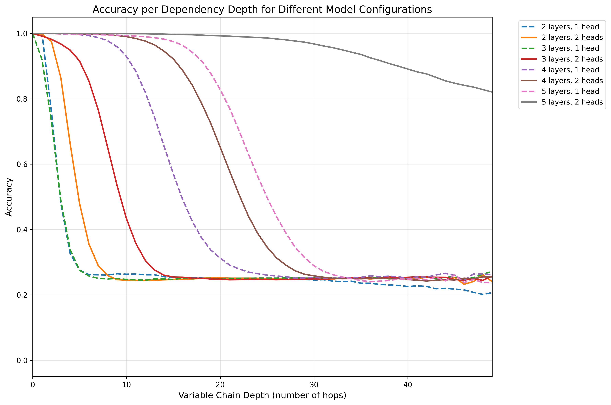
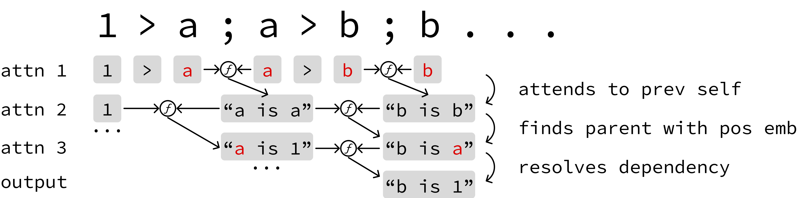
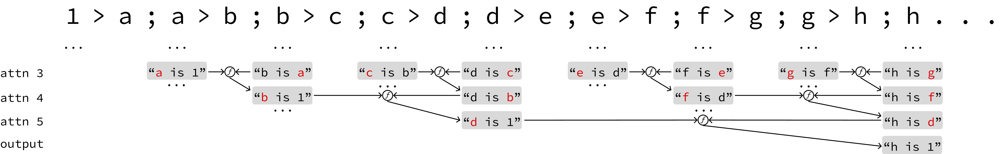
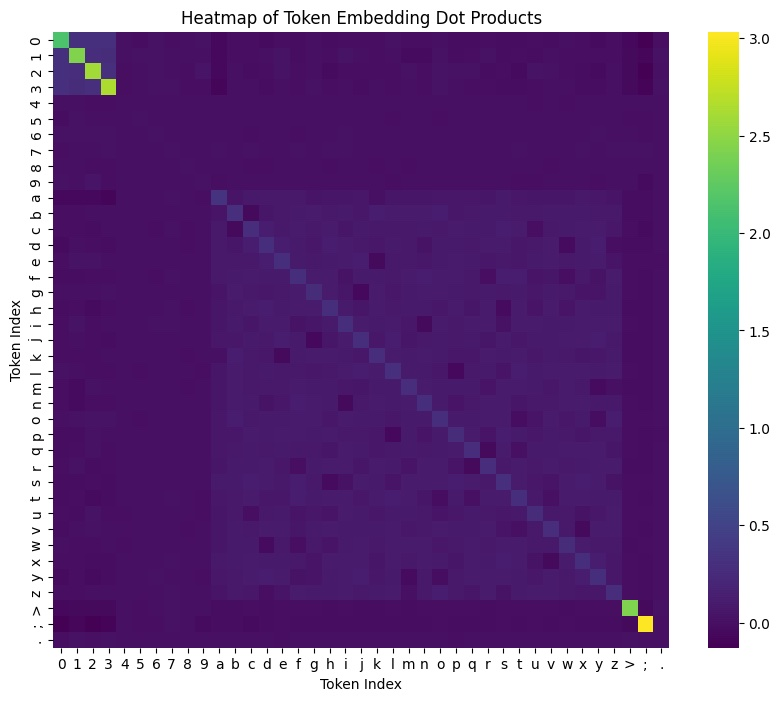
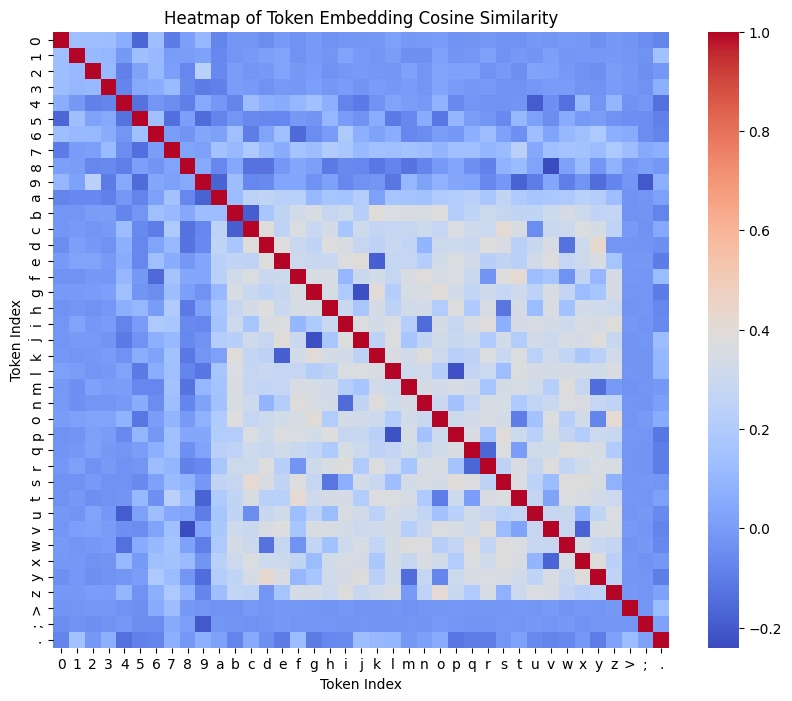

When discussing bottlenecks in transformer context size, we typically focus on position embeddings, the quadratic complexity of attention, and memory constraints. But there's a subtler, equally important limitation hidden in plain sight: context depth.

Let's start with a fun brain teaser. In the codebase below, a segfault occurs downstream of function `f1035()`. Which function caused the bug?
```python
def f1086(): # code may cause segfault
def f1013(): # code may cause segfault
def f1017(): f1086()
def f1094(): f1013()
def f1028(): f1017()
def f1031(): f1028()
def f1003(): f1094()
def f1014(): f1003()
def f1035(): f1031()
def f1081(): f1014()
```

If you said `f1086()`, you're correct! But how did you do it? Chances are, you either tracked evaluations as you read from top to bottom or followed the code path from the bottom up. The key is that it's impossible to know `f1086()` matters until you know `f1017()` matters, and so on. To access relevant sources of truth in code, novels, legal documents, or even X feeds, humans (or networks) must understand what depends on what. While it is true that a token in a decoder-only attention layer *can* attend to any prior token, it's unlikely that it will attend to the correct piece of information in one go. The depth of relationships a token can trace limits the complexity of reasoning it can perform.

Much of this work is inspired by the [Variable Scope](https://variablescope.org/) project, in which Wu, Geiger, and Millière investigated the following variable evaluation task:

```
a=1
b=2
c=a
d=c
e=b
e?
```

Patching the residual stream, they found that information flows from one token to another with each layer, iteratively resolving references to other tokens one layer at a time. In the first few layers, the token `e` might store "e is b" in its activation, and in the next layer, the token `e` might attend to the first `b` and store "e is 2," and so on. Another cool paper by [Prakash et al.](https://arxiv.org/abs/2505.14685) describes a "lookback mechanism" that resembles C pointer dereferencing, in which information flows across references from earlier to later layers.

This all had me wondering: what is the relationship between the number of layers and the *maximum* number of linked references a token can encode in a forward pass? At first glance the relationship seems linear, as each layer allows the query token to reach a subsequent information dependency. On complex codebases or long novels, this result would be especially concerning, as modern LLMs only have layer depths on the order of 60-120 (insert your favorite reddit leak here).

But what if the transformer learns to *divide and conquer*? If each token resolves its own dependencies in parallel, then it might be possible to achieve exponential effective context size with respect to layer depth. In this post, I show that this is indeed the case:
1. With the right formulation, transformers can resolve on the order of $2^n$ token dependencies for $n$ stacked attention layers.
2. Modern LLMs do not exhibit this exponential behavior and instead rely on tool use or chain of thought reasoning to resolve dependencies sequentially.

## Variable Evaluation Experiment

I generated a variable evaluation dataset with an updated objective, trained models of various depths and heads, and analyzed the attention maps to see how the model resolves dependencies in parallel.

### Task Design
I made some changes to the original variable binding task to simplify learning and improve interpretability:
- The task requires the model to evaluate `a>b` instead of `b=a` to improve interpretability of the attention maps, as it allows variable `b` to directly attend to `a` during evaluation. As such, `a` is the assigner and `b` is the assignee.
- Variables (sampled from a-z) may be reused by another chain once they are reassigned.
- Models are not trained under a next-token prediction objective. Instead, the model must predict the original numeric evaluation at each variable token, improving sample efficiency. Model predictions are masked at `;` and `>` tokens for simplicity.
- Accuracy is tracked and reported with respect to dependency depth (0-hops, 1-hop, 2-hops, etc.)

```
Prompt:    2>l;0>c;1>f;3>p;c>u;u>s;s>n;p>w;l>o;o>e;n>u;f>k;
Answer:    2.2.0.0.1.1.3.3.0.0.0.0.0.0.3.3.2.2.2.2.0.0.1.1.
Predicted: 2.2.0.0.1.1.3.3.0.0.0.0.0.0.3.3.2.2.2.2.0.0.2.2.
Correct:   ✔.✔.✔.✔.✔.✔.✔.✔.✔.✔.✔.✔.✔.✔.✔.✔.✔.✔.✔.✔.✔.✔.✘.✘.
```

Above, I included an example prompt, the correct answers, example predictions, and whether those predictions were correct. I don't want to bombard you with the details, but feel free to read through the prompt generation code below:

[VariableRenamingPrompter](train.py#VariableRenamingPrompter)

### Model Architecture
I use a pre-LayerNorm transformer with RoPE positional embeddings, testing configurations from 2-5 layers and 1-2 heads. The vocabulary size is 39 tokens (digits 0-9, letters a-z, symbols `>`, `;`, `.`). I found through early experiments that using RoPE, as opposed to absolute positional embeddings, is crucial for the model to generalize across different chain lengths because it forces each token to perform the same variable lookup operation regardless of its position in the sequence.

### Experimental Parameters
- Training: 1M examples with 150 renames sampled from 4 chains, 10K test examples. It's worth noting that more chains force the model to generalize and not cheat with heuristics.
- Batch size: 128, Learning rate: 1e-4 with 4K warmup steps
- Hyperparameter sweep: 8 configurations testing layer depth (2,3,4,5) × attention heads (1,2)

[Default Training Parameters](train.py#L315-L339)

### Experiment Results

Below is a table summarizing overall accuracy with respect to the number of layers and attention heads after training for 8 days on NVIDIA 2080 GPUs. The results show that more layers improves accuracy, and adding an additional head brings further improvements in performance.

| Hyperparameters   | Value   | Step | Wallclock       |
|-------------------|---------|------|-----------------|
| 2 layers, 1 head  |  0.3131 |  853 | 8d 2h 30m 4s    |
| 2 layers, 2 heads |  0.3466 |  889 | 8d 2h 29m 25s   |
| 3 layers, 1 head  |  0.3086 |  702 | 8d 2h 26m 32s   |
| 3 layers, 2 heads |  0.4229 |  578 | 8d 2h 37m 40s   |
| 4 layers, 1 head  |  0.5541 |  570 | 8d 2h 38m 25s   |
| 4 layers, 2 heads |  0.6672 |  448 | 8d 2h 28m 51s   |
| 5 layers, 1 head  |  0.7195 |  463 | 8d 2h 40m 27s   |
| 5 layers, 2 heads |  0.9765 |  279 | 8d 2h 0m 26s    |


However, what is more interesting is how model performance per depth changes with respect to the number of layers. The results are shown below, where the x-axis is the number of hops (i.e., how many renames away from the original variable) and the y-axis is accuracy. This data was similarly taken after training for 8 days and 2 hours.



For the data with two heads, we can clearly observe an exponential relationship between the number of layers and the performance per chain depth. The two-layer model regresses from perfect accuracy at 2 hops to baseline at 8 hops, the three-layer model drops in performance from 4 to 13 hops, the four-layer model declines from perhaps 10 to 29 hops, and the five-layer model begins to decline perhaps in the low 20s.

Generally, the one head experiments converged much slower or, in the case of the five layer 1 head experiment, have not yet converged. Moreover, it is worth noting that the three layers 1 head regressed heavily at 684 steps. An attention head patching analysis reveals that both heads are heavily utilized in the first layer (see [here](#head-patching)).

## Divide and Conquer Circuit
So how does this tiny transformer achieve exponentially improving performance with respect to the number of layers? The key is that the model learns a divide and conquer copy circuit, where *every* token resolves an independent dependency in parallel, as opposed to only the query token at the end.

Before diving into attention maps on a sample input, I'll first provide an oversimplified summary of the mechanism. Consider the simple 1-chain example: `1>a;a>b;b>c;c>d;d>e;e>f;f>g;g>h;h...`. The first attention layer 1\) distinguishes between the assigner and assignee tokens and 2\) attends assigner tokens to their preceding assignee tokens (e.g. the second `b` attends to the first `b`). The second attention layer uses positional embeddings to attend assigner tokens to their parent assigner tokens (e.g. the second `b` attends to the second `a`). The ensuing layers continue this pattern with assigner tokens and resolve assignee tokens by attending them to their assigners. We can conceptualize each token as having a key (e.g. `b`) and a layer-dependent value (e.g. `a` at the output of layer 2). In the figure below, $f$ generically symbolizes attention & the ensuing MLP transformation. Some tokens are omitted in later attention operations for clarity.



If we continue this pattern, we can quickly observe how the number of hops a token can ultimately resolve is exponential in the number of layers. For example, `h` can theoretically resolve 8 hops back to `1` in a 5 attention-based model.



While this provides a simple primer, the exact mechanism by which divide and conquer copying occurs is slightly more nuanced. For instance, the model learns certain tricks to greatly exceed the implied $2^{n-2}$ limit from above. Let's dive into the attention maps to gain a more complete picture.

### Attention Maps
In this section, I analyze the attention maps of a 5 layer, 2 head transformer after 284 epochs on the prompt generated with seed `42`, which it predicts with 100% accuracy. For context, the maximum chain depth in this prompt is 43 at `n>h;`.
```
Prompt:
2>l;0>c;1>f;3>p;c>u;u>s;s>n;p>w;l>o;o>e;n>u;f>k;u>n;e>l;w>c;k>x;c>v;n>g;x>d;g>s;l>b;s>l;l>r;r>t;v>k;b>n;k>p;p>u;d>y;y>i;t>k;n>x;x>b;b>v;u>m;m>s;v>h;s>p;i>y;h>d;k>q;y>c;d>u;q>k;k>w;u>x;x>g;c>r;p>v;v>t;t>u;w>t;r>l;l>h;t>o;g>n;h>a;u>g;g>l;a>s;n>w;s>b;o>p;b>o;o>b;b>u;w>o;l>h;o>z;h>g;z>y;p>a;g>v;v>t;y>x;x>k;u>d;d>o;a>z;o>j;k>l;z>h;t>i;i>c;c>u;j>s;l>r;u>x;s>y;x>l;y>m;r>d;d>g;g>t;m>q;t>z;l>i;i>j;h>k;k>m;q>l;z>t;m>f;f>g;l>v;t>s;s>b;j>m;g>d;b>s;m>r;s>u;v>n;r>l;d>a;a>m;n>r;u>g;r>d;d>c;c>r;l>u;g>v;u>d;v>f;f>s;d>q;q>d;r>v;d>h;m>z;v>k;s>p;k>g;h>d;z>l;p>n;l>b;d>j;n>s;s>m;b>e;g>p;m>v;v>y;y>n;p>w;n>h;j>l;e>a;
Answer:
2.2.0.0.1.1.3.3.0.0.0.0.0.0.3.3.2.2.2.2.0.0.1.1.0.0.2.2.3.3.1.1.3.3.0.0.1.1.0.0.2.2.0.0.0.0.0.0.3.3.2.2.3.3.3.3.1.1.1.1.0.0.2.2.2.2.2.2.3.3.3.3.2.2.3.3.1.1.2.2.0.0.1.1.2.2.0.0.0.0.2.2.2.2.1.1.3.3.3.3.3.3.0.0.1.1.1.1.0.0.2.2.1.1.3.3.3.3.1.1.2.2.1.1.0.0.1.1.1.1.1.1.2.2.3.3.2.2.3.3.2.2.0.0.3.3.3.3.2.2.2.2.1.1.1.1.0.0.1.1.2.2.0.0.3.3.3.3.3.3.1.1.2.2.3.3.1.1.3.3.1.1.2.2.2.2.2.2.1.1.2.2.3.3.3.3.0.0.0.0.1.1.2.2.0.0.0.0.1.1.2.2.2.2.3.3.0.0.2.2.3.3.2.2.1.1.3.3.0.0.0.0.1.1.2.2.1.1.1.1.1.1.3.3.2.2.3.3.2.2.2.2.3.3.3.3.1.1.3.3.0.0.1.1.2.2.1.1.3.3.0.0.2.2.0.0.3.3.2.2.2.2.0.0.1.1.2.2.2.2.2.2.1.1.2.2.3.3.0.0.
Predicted:
222100011111333100000000000133312221222200001111000022223333111133310000111100002222000000000000333322223330333311111111000022222222222033303330222233331110222200001110222200000003222223221111333333333030000011101010000022221113333333331111222211110000111110111011222133302221333322230000333330332222202211111111000011112222000033303033303311112221333311133333111122222222222211112222333333330000000011112222000002001111222222223332000022223333222211113333000002021111222011101010101033322222333222202223333230321110333200021111222211123332000222230002333322222023000011122222232323231112232333330000
Right:
✔.✔.✔.✔.✔.✔.✔.✔.✔.✔.✔.✔.✔.✔.✔.✔.✔.✔.✔.✔.✔.✔.✔.✔.✔.✔.✔.✔.✔.✔.✔.✔.✔.✔.✔.✔.✔.✔.✔.✔.✔.✔.✔.✔.✔.✔.✔.✔.✔.✔.✔.✔.✔.✔.✔.✔.✔.✔.✔.✔.✔.✔.✔.✔.✔.✔.✔.✔.✔.✔.✔.✔.✔.✔.✔.✔.✔.✔.✔.✔.✔.✔.✔.✔.✔.✔.✔.✔.✔.✔.✔.✔.✔.✔.✔.✔.✔.✔.✔.✔.✔.✔.✔.✔.✔.✔.✔.✔.✔.✔.✔.✔.✔.✔.✔.✔.✔.✔.✔.✔.✔.✔.✔.✔.✔.✔.✔.✔.✔.✔.✔.✔.✔.✔.✔.✔.✔.✔.✔.✔.✔.✔.✔.✔.✔.✔.✔.✔.✔.✔.✔.✔.✔.✔.✔.✔.✔.✔.✔.✔.✔.✔.✔.✔.✔.✔.✔.✔.✔.✔.✔.✔.✔.✔.✔.✔.✔.✔.✔.✔.✔.✔.✔.✔.✔.✔.✔.✔.✔.✔.✔.✔.✔.✔.✔.✔.✔.✔.✔.✔.✔.✔.✔.✔.✔.✔.✔.✔.✔.✔.✔.✔.✔.✔.✔.✔.✔.✔.✔.✔.✔.✔.✔.✔.✔.✔.✔.✔.✔.✔.✔.✔.✔.✔.✔.✔.✔.✔.✔.✔.✔.✔.✔.✔.✔.✔.✔.✔.✔.✔.✔.✔.✔.✔.✔.✔.✔.✔.✔.✔.✔.✔.✔.✔.✔.✔.✔.✔.✔.✔.✔.✔.✔.✔.✔.✔.✔.✔.✔.✔.✔.✔.✔.✔.✔.✔.✔.✔.✔.✔.✔.✔.✔.✔.✔.✔.✔.✔.✔.✔.
```

#### Layer 1 Attention Maps
**These attention maps are interactive!** As per standard, tokens along the y axis attend to tokens along the x axis. Black squares are where the normalized attention probability gets too small to matter. You may explore the attention maps of both heads by **scrolling** left and right. You may also drag and **select** a region you'd like to magnify and double click to return to the original zoom. For memory reasons, I have only included the first 100 tokens of each head.

[Layer 1 Attention Maps](assets/l1_attn_map.html)

Let's start by examining how both maps treat the first variable in an assignment operator (e.g. `x` in `x>y;`). Specifically, zoom to the top ~20 characters of the first head's map and observe the path where `0>c;...;c>u`. If you view the row of the second `c`, you can observe that it attends primarily to the first `c` that appears before it. Something similar happens in the second head for `c`, but if you zoom out, it appears to specialize at different relative distances. Together, they discover most self-to-self relationships, passing the embedding of the former to the latter, thereby giving the second instance the relative *position* of the first (this will come in handy later!). The fact that *both* heads learned slightly different lookback ranges is somewhat of a mystery to me, but it's likely a function of the RoPE base not being fully calibrated and rotational finessing to avoid the case where a letter attends to a stale instance of same letter in a different chain.

Now let's see how the second variable in an assignment operator (e.g. `y` in `x>y;`) gets treated. I initially thought `y` should always attend to `x` using relative positions, but `y` has no way of telling whether the character two before it belongs to the `x>y` assignment or `x;y` sequence, the latter of which might assign `y` to an `x` of a different chain. As such, both heads seem to encode positional information: head 1 makes `y` attend to preceding `;` and `>` instances, and head 2 makes `y` attend strongly to preceding `>` instances with consistent relative distances. This lets future layers know that `y` is the one getting assigned and not the one doing the assigning.

While not too important for this analysis, another interesting pattern is that `>` and `;` tokens throughout the sequence tend to attend to all numerical tokens and other `>` and `;` tokens to some degree, creating the striking lattice pattern. I hypothesize that this serves (or once served) as a fallback mechanism for when the model needs to make an educated guess. The numerical tokens themselves aren't that interesting to analyze, as the residual pathway will ensure their identity is always present.

#### Layer 2 Attention Maps

[Layer 2 Attention Maps](assets/l2_attn_map.html)

Layer 2 is interesting because the second head appears much more information dense than the first. We can confirm that the second head is much more important than the first by patching the heads and examining performance regressions (see [here](#head-patching)).

We can start by observing how all tokens in `2>l`, `0>c`, `1>f`, and `3>p` attend directly to `2`, `0`, `1`, and `3` respectively. Continuing across the prompt, we see an interesting pattern emerge where the assigner attends directly to its parent. Let's continue analyzing the second instance of the `c` variable (from `c>u;`). It likely uses the relative distance to the first `c` from the previous layer to determine that it should attend directly to `0`. The ensuing `>` and `u` tokens from `c>u;` have no way of knowing to attend to `0` from the previous layer and thus attend to the second `c`. If you zoom out you'll see this exact attention pattern everywhere.

However, there are some fascinating exceptions. For instance, examine the sequence of back-to-back reassignments `c>u;u>s;s>n`. In head 2, all variables in this sequence skip the line and directly attend to the second `c`. If you zoom out, you'll see occasional long vertical lines of high attention (some 4 hops in length!) in which back-to-back reassignments attend directly to the first of the sequence. I hypothesize that the model learns to exploit the fact that back-to-back assignments imply the first of which belongs to the same chain as the last. Back-to-back hops are likely transformed differently in the first layer, allowing the model to use positional embeddings to selectively attend to the first of the sequence. This trick allows the model to resolve chains of lengths much greater than the theoretical expectation.

#### Layer 3 Attention Maps

[Layer 3 Attention Maps](assets/l3_attn_map.html)

Let's start in head 2 and inspect the direct numerical assignments (e.g. `1>f`). Recall that in layer 2, the `1`, `>`, and `f` tokens all attend to `2`. Now, these tokens attend to themselves and other members of the operation. In other words, they have been fully resolved in layer 2 and are simply preserving the information they previously stored.

Now let's look at the `c>u;` operation. In layer 2, we saw that the first `c` attended directly to 0 whereas the following `>` and `u` tokens only attended to `c`. In layer 3, `c` attends to itself because it has already resolved into a number, while `>` and `u` now attend to `0`. From here on out, we can observe a similar pattern across layers: the assigner resolves itself by attending to its parent (typically the assigner) and taking on the parent's *current* value. In the following layer, the assignee resolves itself to the parent's value by attending to the assigner. When a variable has resolved into a number, it attends primarily to itself.

An interesting aspect of layer 3 is that both heads appear to be information dense. However, it is worth noting that the second layer turns out to be slightly more important than the first on this prompt, as patching the second head results in an accuracy of 34% whereas patching the first head results in an accuracy of 59% (see [here](#head-patching)).

#### Layer 4 Attention Maps

[Layer 4 Attention Maps](assets/l4_attn_map.html)

Layer 4 continues the pattern of the previous layer, where the assigner attends to its parent and takes on the parent's *current* value. The assignee resolves itself to the parent's value by attending to the parent assigner or the parent assignee.

#### Layer 5 Attention Maps

[Layer 5 Attention Maps](assets/l5_attn_map.html)

For the most part, elements in layer 5 attend to themselves or tokens within the same operation. However, as the recursive depth of the variable chains increase, some tokens form long-range connections to other tokens in the same assignment sequence. I recommend playing around with the notebook included in the [project repo](https://github.com/michael-lutz/divide-and-conquer) to see how the attention maps change as the number of layers increases.


## LLMs Have Low Context Depth
If a simple transformer can resolve an exponential number of dependencies with layer depth, LLMs with 100s of layers should be able to resolve an effectively infinite number of dependencies, right? After all, a 120-layer model should be able to perform close to $2^{120} = 1.3 \times 10^{36}$ hops.

Try pasting the prompt from [above](#attention-maps) into a chatbot like Claude or ChatGPT, and it will likely try to solve the problem by evoking a code interpreter or by manually resolving relationships one token at a time through chain of thought reasoning. Chain of thought allows the model to cache the most recent evaluation and perform a shallow lookback to its parent. For example, if the prompt is `a>b;b>c;`, the model can generate "c is b" and use the `b` token to subsequently generate "b is a"—all while performing only one hop per generated token.

The question remains: how many hops can an LLM perform per *token generation*? Try plugging this prompt (which is the first 25% of the prompt from [above](#attention-maps)) into your favorite chatbot and running it a few times. Note that instructing the model to provide the answer first should dissuade the model from solving the problem sequentially through chain of thought.
```
The a>b operator means b=a, or b resolves to a. Assume the operations are evaluated by an interpreter in this exact order.

2>l;0>c;1>f;3>p;c>u;u>s;s>n;p>w;l>o;o>e;n>u;f>k;u>n;e>l;w>c;k>x;c>v;n>g;x>d;g>s;l>b;s>l;l>r;r>t;v>k;b>n;k>p;p>u;d>y;y>i;t>k;n>x;x>b;b>v;u>m;m>s;v>h;s>p;i>y;h>d;k>q;y>c;

After execution, what number does c evaluate to? Give your answer first and then why.
```
When I tried this (as of July 11th, 2025), both Claude and GPT-4o cycled between 0 and 2, failing to provide the correct answer of 1. The correct path: `1>f>k>x>d>y>i>y>c` only requires 8 hops, and our 5-layer breezed through this question with ease!

But sure... this type of prompt likely wasn't in the training data of either model, so let's try something that will appear more familiar. 
```
In the codebase below, a bug occurs. I know f11164() gets called. Which function caused the bug? Provide your answer and then why.

def f14698():
    raise RuntimeError('Unknown error occurred')

def f11164():
    raise RuntimeError('Unknown error occurred')

def f18424():
    raise RuntimeError('Unknown error occurred')

def f11437():
    raise RuntimeError('Unknown error occurred')

def f16675():
    f18424()

def f19706():
    f11437()

def f14318():
    f19706()

def f13588():
    f11164()

def f19781():
    f16675()

def f13578():
    f13588()

def f10571():
    f14698()

def f14037():
    f19781()

def f15394():
    f14037()

def f14642():
    f10571()

def f15294():
    f14642()

def f11955():
    f14318()

def f19783():
    f13578()

def f11098():
    f15394()

def f12421():
    f11955()

def f14363():
    f11098()

def f13261():
    f12421()

def f12227():
    f15294()

def f18920():
    f13261()

def f17094():
    f18920()

def f17819():
    f19783()

def f10747():
    f14363()

def f13086():
    f10747()
```

The answer is `f18424` after 9 hops, but GPT-4o insisted across multiple calls that the answer was `f14698`.

## Why This Matters
Despite having the theoretical ability to understand exponentially many dependencies per token generation, modern LLMs do not learn to exploit this mechanism. I hypothesize that most human-generated pretraining data and reasoning traces primarily involve shallow lookbacks, and thus LLMs never need to learn the divide and conquer circuit. Each token generation may only require a single digit lookback depth, and that saturates most pre-training and post-training objectives.

**But why train models to think like humans, bound by shallow hops, when they can learn to grasp entire dependency graphs?**

It's easy to see how precisely encoding *all* of a text's dependencies at the time of generation would allow a model to form connections that would otherwise be impossible to spot. If we are to develop machines that greatly exceed human reasoning abilities, teaching them to understand complex information dependencies seems natural and necessary. The fact remains that *you don't know what you don't know*, and it is easy to miss important connections that are not obvious within a few hops.

Moreover, information dependencies are often not structured in linear chains, but rather graphs. If you've ever asked a model to debug a deadlock in a complicated code base, you'll know that LLMs struggle to understand the delicate ordering of code and high branching factor of potential culprit code paths. Chain of thought reasoning through every suspicious path is intractable due to the exponential growth of tokens required.

## Follow Up Ideas
I don't have access to a large distributed learning setup, but if I did, I'd start by adding a pretraining objective that requires a model to resolve a large number of dependencies per token. To avoid disrupting the natural abstraction of information, it might be worth warm-starting this circuit by freezing most heads and weight-sharing a head from the third layer and onwards to enforce a recursive divide and conquer mechanism. Another subtle detail is that the question must be provided before the context, otherwise the model would be unable to resolve the problem in parallel.

An interesting follow-up direction is to explore the ability of small models to perform search through graph-like dependency relationships. Moreover, it could also be helpful to figure out how to effectively weight-share the divide and conquer circuit, demonstrating truly infinite context depth.

Thanks for reading! If you have any feedback or ideas, feel free to make an issue or PR on the [project repo](https://github.com/michael-lutz/divide-and-conquer). I have provided all model configurations & checkpoints and encourage you to perform your own analysis.

P.S. I'm always looking for collaborators to work on open-source projects. Reach out to me [on X](https://x.com/Michael_J_Lutz)!


## Acknowledgements

I'd like to thank Nathan Gong and Michael Equi for their consistent feedback on this project. I'd also like to thank the [Variable Scope](https://variablescope.org/) team for their work on the variable evaluation task, as it served as a major inspiration. The framework I built for this project, [iluvattnshun](https://github.com/michael-lutz/iluvattnshun), is heavily inspired by [xax](https://github.com/kscalelabs/xax/) and Ben Bolte's design patterns.

## Appendix

### Theoretical Foundation

This section provides a formal proof of why transformers can achieve exponential dependency resolution capacity with respect to layer depth.

#### Exponential Capacity Theorem

> **Theorem**: With $n$ attention layers, a transformer can resolve dependencies on the order of $2^{n-2}$ in a single forward pass if each dependency resolution does not require future information.
>
>**Base case** ($n = 2$): A 2-layer model can resolve 1-hop dependencies by directly attending to immediate predecessors.
>
>**Inductive step**: Assume an $n$-layer model can resolve dependencies up to depth $2^{n-3}$. An $(n+1)$-layer model can then:
>1. Use the first $n$ layers to resolve dependencies up to depth $2^{n-3}$
>2. Use the final layer to combine this information and resolve dependencies up to depth $2^{n-2}$
>
>This works because each token in layer $n+1$ can attend to all previous tokens, including those that have already resolved their dependencies in the first $n$ layers.
>
>**Formally**: If token $v$ has a dependency path of length $d \leq 2^{n-2}$ to some source $s$, then in layer $n+1$:
>- $v$ has already resolved its dependencies up to depth $2^{n-3}$ by the inductive hypothesis
>- $v$ can attend to a token $u$ that has already resolved its dependencies up to depth $2^{n-3}$
>- The attention mechanism can combine the information from $v$ and $u$ to resolve the full path of depth up to $2^{n-2}$

This proof establishes the theoretical foundation for exponential dependency resolution. The key insight is that as long as each dependency resolution does not require future information, it is possible to resolve dependencies in parallel. Each additional layer doubles the effective dependency depth by allowing tokens to combine information from multiple previously resolved paths, rather than just extending a single path linearly.


### Head Patching

To understand the relative importance of each attention head, I performed head patching experiments where individual heads were replaced with their activations from a different prompt (seed 420) while keeping all other heads from the original prompt (seed 42). This technique reveals which heads are most critical for the model's performance on the variable evaluation task.

The results show a an interesting pattern of head specialization across layers. The numbers in the table represent the accuracy achieved when that specific head is patched (replaced with activations from a different prompt), with lower values indicating the head is more critical for performance:

| Layer | Head 0 | Head 1 | Most Important |
|-------|--------|--------|----------------|
| 1     | 0.2367 | 0.2467 | both           |
| 2     | 0.5100 | 0.2033 | head 1         |
| 3     | 0.5900 | 0.3400 | head 1         |
| 4     | 0.3000 | 0.8767 | head 0         |
| 5     | 0.8700 | 0.5100 | head 1         |

Several interesting patterns emerge from this analysis:

- **Layer 1**: Both heads show similar importance (23.67% vs 24.67%), suggesting they work together to establish the initial self-attention patterns for variable lookups. This layer likely handles the basic token-to-token relationships that form the foundation for subsequent processing.

- **Layer 2**: Head 1 is significantly more important (51.00% vs 20.33%), indicating it plays a crucial role in establishing the positional relationships between assigners and assignees. This aligns with the attention map observations where head 1 showed more information-dense patterns.

- **Layer 3**: Head 1 remains dominant (59.00% vs 34.00%), continuing its role in resolving direct parent-child relationships in the variable chains. The continued importance of head 1 suggests it maintains responsibility for the core dependency resolution mechanism.

- **Layer 4**: Head 0 is dramatically more important (87.67% vs 30.00%), suggesting it takes over the primary role in propagating resolved values through the dependency chains. This represents a shift in computational responsibility as the model moves to higher-level reasoning.

- **Layer 5**: Head 1 is the most important (87.00% vs 51.00%), likely handling the final resolution of complex multi-hop dependencies. The return to head 1 suggests it specializes in the most sophisticated aspects of the divide-and-conquer mechanism.

### Token Embeddings
I thought it might be interesting to examine how token embeddings were structured by the end of training. The following dot product and cosine similarity heatmaps are generated from the same 5 layer 2 head model from before.




We can see that numbesr 1-4 (only numbers in the dataset), `;`, and `>` have the highest magnitudes, leading to the lattice pattern observed in the first layer. Additionally, we can see that letters are somewhat close to each other (cosine similarity ~.3) in the embedded space.

